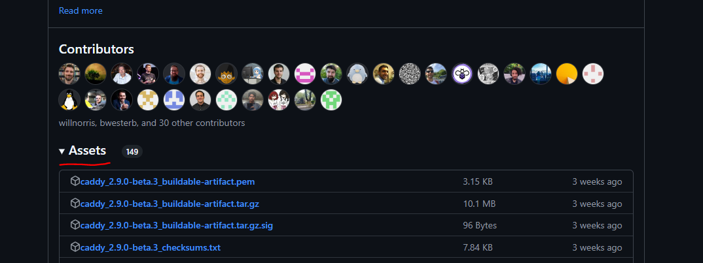
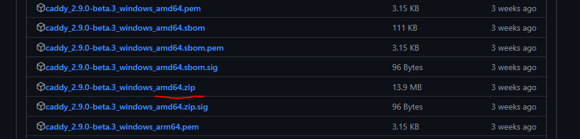
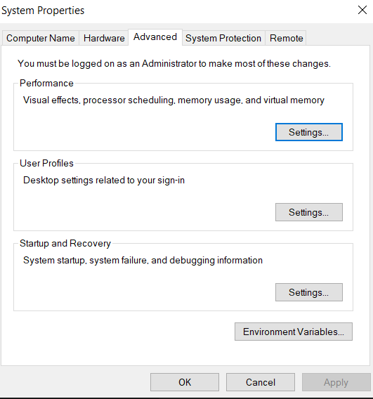
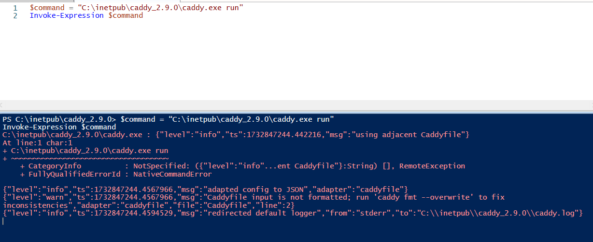
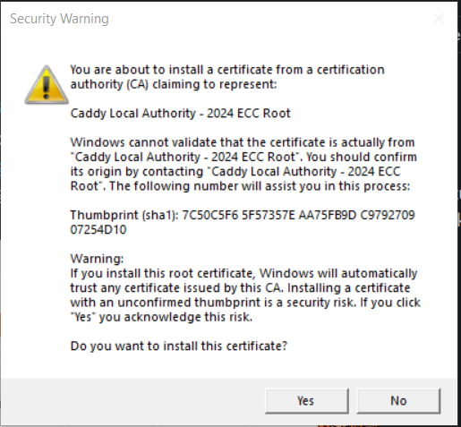

# caddyserver AKA **Caddy**

## _[Caddy](https://caddyserver.com/docs/) is a powerful, extensible platform to serve your sites, services, and apps._

✨Magic✨

## Getting Started

### Objectives:

- Install Caddy: Learn how to download and set up Caddy on your machine.
- Run the Caddy Daemon: Understand how to start Caddy as a background service (daemon) and ensure it keeps running to serve your applications or websites.
- Provide Caddy a Configuration: Get hands-on experience writing a configuration file (Caddyfile). You'll use this file to define the behavior of your server, including reverse proxies and static file serving.
- Test Your Configuration: Validate that your Caddy setup works as expected. You'll learn how to troubleshoot errors and reload the configuration after making changes.

### Prerequisites:

- Basic terminal / command line skills
- Basic text editor skills
- Do not have IIS running.

### Installation

The simplest, cross-platform way to get started is to download Caddy from [GitHub Releases](https://github.com/caddyserver/caddy/releases) and place the executable file in your PATH.

> Note: We are going to work with version v2.9.XX.
>
> If you don’t want to modify the environment variables, you can always specify the full path to the executable each time you run it, but adding it to the PATH is more convenient for repeated use.

Once in the releases page, we go to the latest version and, in the Assets section, we download the one that corresponds to Windows.

> Note: Usually, the file name ends with the following text: \_windows_amd64.zip.




Once the zip file has been downloaded. Next, we must unzip the content in a path that is easy to identify; it will be easier for us later.

> Note: I am going to manage it in the path C:\inetpub\caddy_2.9.0.

#### Adding Caddy to the System PATH on Windows

> Note: If you don’t want to modify the environment variables ignore that and you can always specify the full path to the executable each time you run it, but adding it to the PATH is more convenient for repeated use.

To run Caddy from any terminal without specifying its full path, you need to add the directory containing the Caddy executable to your system's PATH. Follow these steps:

1. Locate the Directory with Caddy

   - If you followed this guide, your Caddy executable should be in a directory like:

```
C:\inetpub\caddy_2.9.0
```

2. Open System Settings

   - Press `Win + S` and search for _"Environment Variables"_.
   - Click on the option Edit the system environment variables.

   

3. Edit the PATH Variable
   - In the System Properties window, click the Environment Variables button.
   - Under the System Variables section, find the variable named Path, select it, and click Edit.
4. Add Caddy’s Directory

- In the window that appears, click New and enter the full path to the directory where you placed the Caddy executable. For example:

```
C:\inetpub\caddy_2.9.0
```

- Click OK in all windows to save the changes.

5. Verify the Configuration

- Open a new PowerShell or Command Prompt window and run:

```
caddy version
```

### Your first config

There are two ways to configure our Caddy: the first is with a JSON file, which allows us to have more control over the configurations, and the second is with a Caddyfile, which is somewhat simpler, but has limitations in terms of configuration.

> Note: For the moment, we are only going to handle the Caddyfile, but feel free to explore the JSON.

The basic structure of the Caddyfile is to indicate its listeners via [Request Matchers](https://caddyserver.com/docs/caddyfile/matchers), which can filter (or classify) the requests by various criteria, e.g. the host name (domain name) of the site you want to manage and for what purpose. For example, you can return a static page, redirect traffic to another site or do a redirect. Let's create an example file for my.domain.com.mx.

> Note: Caddy will serve your proxy over HTTPS automatically and by default.

```sh
example.com {
    reverse_proxy localhost:3000
}
```

Save it in a file named Caddyfile (without extension) in the directory where you have Caddy.

> Note: We are going to assume that the PATH was not given so we are going to use instructions with the full path.

Now, with the Caddyfile already available, it is just a matter of running Caddy as a daemon. To do so, we must execute the following command from PowerShell ISE:

```sh
$command = “C:\inetpub\caddy_2.9.0\caddy.exe run"
Invoke-Expression $command
```

Once the command is executed, we should see a response similar to the following image:



The first time you navigate to a site proxied from Caddy, it will ask you to install its certificate, so that the browser will
consider it valid and will not show you any alert that the site is not secure.



> Note: For Caddy to resolve the domain my.domain.com.mx, it must be registered in the Host file of your computer pointing to 127.0.0.1.

All we have to do is open our browser and enter the domain we have just configured: https://my.domain.com.mx/.

If you change the Caddyfile, make sure to reload Caddy.

### Advanced configurations

#### [handle_path](https://caddyserver.com/docs/caddyfile/concepts#snippets)

Handling a request matching a certain path (while stripping that path from the request URI) is a common enough use case that it has its own directive for convenience.

```sh
example.com {
	# Serve your API, stripping the /api prefix
	handle_path /api/* {
		reverse_proxy localhost:9000
	}

	# Serve your static site
	handle {
		root * /srv
		file_server
	}
}
```

#### [Snippets](https://caddyserver.com/docs/caddyfile/concepts#snippets)

You can define special blocks called snippets by giving them a name surrounded in parentheses:

```sh
(logging) {
	log {
		output file /var/log/caddy.log
		format json
	}
}
```

And then you can reuse this anywhere you need, using the special import directive:

```sh
example.com {
	import logging
}

www.example.com {
	import logging
}
```

#### [Logging](https://caddyserver.com/docs/caddyfile/directives/log)

To configure logs, you need to add a log directive, which enables and configures HTTP request logging (also known as access logs).
The log directive can be used globally or per site block.

```sh
log [<logger_name>] {
	hostnames <hostnames...>
	no_hostname
	output <writer_module> ...
	format <encoder_module> ...
	level  <level>
}
```

In some scenarios, it is necessary to have logs that allow us to get more context on what is happening and to execute our rules. To do this, we can enable debug mode as follows:

```sh
{
	debug
	log {
		output file caddy.log
		format json
	}
}
```

#### Useful commands

- Command that allows to execute Caddy with a specific configuration file, either a Caddyfile or a JSON.

```sh
command = “C:\inetpub\caddy_2.9.0\caddy.exe run --config caddy.json”
Invoke-Expression $command
```

- Script that allows us to translate our Caddyfile to JSON.

```sh
$commandFmt = “C:\inetpub\caddy_2.9.0\caddy.exe fmt --overwrite”
$commandAdapt = “C:\inetpub\caddy_2.9.0\caddy.exe adapt”
Invoke-Expression $commandFmt
Invoke-Expression $commandAdapt
```

#### Common Errors and Troubleshooting

Here are some common issues you might encounter while configuring or running Caddy, along with potential solutions:

**Error: "Cannot bind to port 443"**

- **Cause:** Another service (e.g., IIS, Apache, or another web server) is already using port 443, which is the default port for HTTPS.
- **Solution:**
  1. Stop the conflicting service using port 443. For example, to stop IIS, run:
     ```sh
     Stop-Service -Name 'W3SVC'
     ```

**Error: "Caddyfile validation failed"**

- **Cause:** The syntax or structure of your Caddyfile is incorrect.
- **Solution:**
  1. Run the following command to validate your configuration:
     ```sh
     caddy validate --config /path/to/Caddyfile
     ```
  2. Check the [Caddyfile documentation](https://caddyserver.com/docs/caddyfile) to ensure you're using the correct syntax.

**Error: "Certificate not trusted"**

- **Cause:** If using a self-signed certificate (common in local environments), the browser may warn that the certificate is untrusted.
- **Solution:**
  1. Install the certificate into your operating system or browser's trusted root store.
  2. For production, let Caddy automatically fetch valid certificates using Let's Encrypt.

**Error: "Domain does not resolve"**

- **Cause:** The domain you configured in your Caddyfile (e.g., `example.com`) does not point to your local machine or server.
- **Solution:**
  1. For local development, add the domain to your computer's **hosts file** pointing to `127.0.0.1`. On Windows, you can edit `C:\Windows\System32\drivers\etc\hosts` and add:
     ```txt
     127.0.0.1 example.com
     ```
  2. For production, ensure your DNS records are correctly configured to point to your server's IP address.

**Error: "Permission denied"**

- **Cause:** Caddy may not have the necessary permissions to bind to privileged ports (e.g., 80 or 443) or access certain directories.
- **Solution:**
  1. Run Caddy with elevated privileges (e.g., as an administrator on Windows or with `sudo` on Linux).
  2. Consider using a reverse proxy on a higher, unprivileged port, such as 8080, if permissions cannot be granted.
